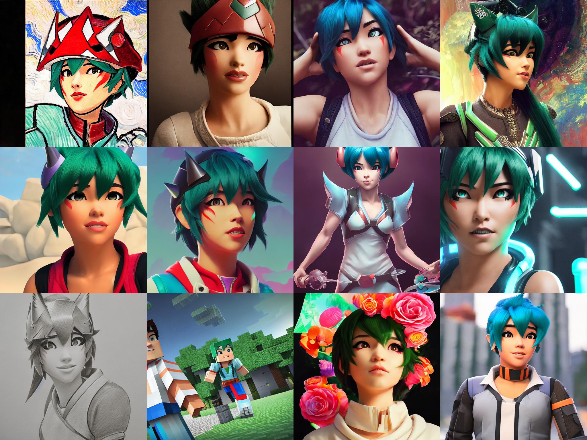
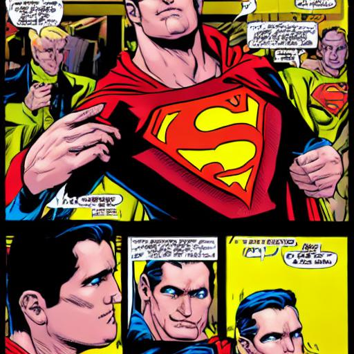
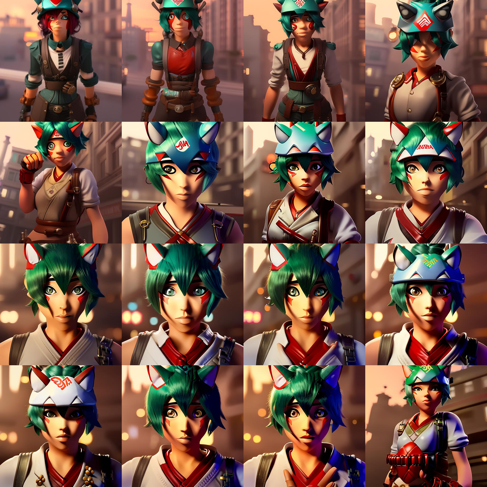
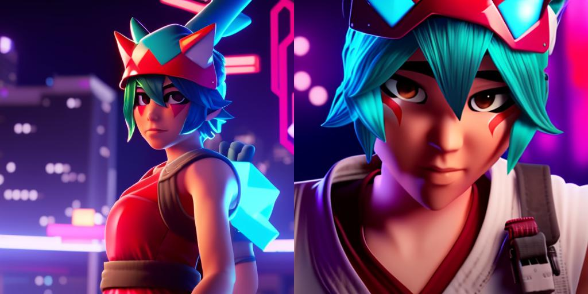
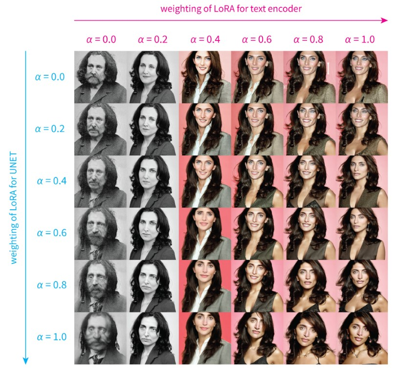

# Low-rank Adaptation for Fast Text-to-Image Diffusion Fine-tuning

<!-- #region -->
<p align="center">

</p>
<!-- #endregion -->

> Using LoRA to fine tune on illustration dataset : $W = W_0 + \alpha \Delta W$, where $\alpha$ is the merging ratio. Above gif is scaling alpha from 0 to 1. Setting alpha to 0 is same as using the original model, and setting alpha to 1 is same as using the fully fine-tuned model.

<!-- #region -->
<p align="center">

</p>
<!-- #endregion -->

> SD 1.5 PTI on Kiriko, the game character, Various Prompts.

<!-- #region -->
<p align="center">

</p>
<!-- #endregion -->

> `"baby lion in style of <s1><s2>"`, with disney-style LoRA model.

<!-- #region -->
<p align="center">

</p>
<!-- #endregion -->

> `"superman, style of <s1><s2>"`, with pop-art style LoRA model.

## Main Features

- Fine-tune Stable diffusion models twice as fast than dreambooth method, by Low-rank Adaptation
- Get insanely small end result (1MB ~ 6MB), easy to share and download.
- Compatible with `diffusers`
- Support for inpainting
- Sometimes _even better performance_ than full fine-tuning (but left as future work for extensive comparisons)
- Merge checkpoints + Build recipes by merging LoRAs together
- Pipeline to fine-tune CLIP + Unet + token to gain better results.
- Out-of-the box multi-vector pivotal tuning inversion

# Web Demo

- Integrated into [Huggingface Spaces 🤗](https://huggingface.co/spaces) using [Gradio](https://github.com/gradio-app/gradio). Try out the Web Demo [](https://huggingface.co/spaces/lora-library/LoRA-DreamBooth-Training-UI)

- Easy [colab running example](https://colab.research.google.com/drive/1iSFDpRBKEWr2HLlz243rbym3J2X95kcy?usp=sharing) of Dreambooth by @pedrogengo

# UPDATES & Notes

### 2023/02/06

- Support for training inpainting on LoRA PTI. Use flag `--train-inpainting` with a inpainting stable diffusion base model (see `inpainting_example.sh`).

### 2023/02/01

- LoRA Joining is now available with `--mode=ljl` flag. Only three parameters are required : `path_to_lora1`, `path_to_lora2`, and `path_to_save`.

### 2023/01/29

- Dataset pipelines
- LoRA Applied to Resnet as well, use `--use_extended_lora` to use it.
- SVD distillation now supports resnet-lora as well.
- Compvis format Conversion script now works with safetensors, and will for PTI it will return Textual inversion format as well, so you can use it in embeddings folder.
- 🥳🥳, LoRA is now officially integrated into the amazing Huggingface 🤗 `diffusers` library! Check out the [Blog](https://huggingface.co/blog/lora) and [examples](https://github.com/huggingface/diffusers/tree/main/examples/text_to_image#training-with-lora)! (NOTE : It is CURRENTLY DIFFERENT FILE FORMAT)

### 2023/01/09

- Pivotal Tuning Inversion with extended latent
- Better textual inversion with Norm prior
- Mask conditioned score estimation loss
- safetensor support, xformers support (thanks to @[hafriedlander](https://github.com/hafriedlander))
- Distill fully trained model to LoRA with SVD distillation CLI
- Flexiable dataset support

### 2022/12/22

- Pivotal Tuning now available with `run_lorpt.sh`
- More Utilities added, such as datasets, `patch_pipe` function to patch CLIP, Unet, Token all at once.
- Adjustable Ranks, Fine-tuning Feed-forward layers.
- More example notebooks added.

### 2022/12/10

- **You can now fine-tune text_encoder as well! Enabled with simple `--train_text_encoder`**
- **Converting to CKPT format for A1111's repo consumption!** (Thanks to [jachiam](https://github.com/jachiam)'s conversion script)
- Img2Img Examples added.
- Please use large learning rate! Around 1e-4 worked well for me, but certainly not around 1e-6 which will not be able to learn anything.

# Lengthy Introduction

Thanks to the generous work of Stability AI and Huggingface, so many people have enjoyed fine-tuning stable diffusion models to fit their needs and generate higher fidelity images. **However, the fine-tuning process is very slow, and it is not easy to find a good balance between the number of steps and the quality of the results.**

Also, the final results (fully fined-tuned model) is very large. Some people instead works with textual-inversion as an alternative for this. But clearly this is suboptimal: textual inversion only creates a small word-embedding, and the final image is not as good as a fully fine-tuned model.

Well, what's the alternative? In the domain of LLM, researchers have developed Efficient fine-tuning methods. LoRA, especially, tackles the very problem the community currently has: end users with Open-sourced stable-diffusion model want to try various other fine-tuned model that is created by the community, but the model is too large to download and use. LoRA instead attempts to fine-tune the "residual" of the model instead of the entire model: i.e., train the $\Delta W$ instead of $W$.

$$
W' = W + \Delta W
$$

Where we can further decompose $\Delta W$ into low-rank matrices : $\Delta W = A B^T $, where $A, \in \mathbb{R}^{n \times d}, B \in \mathbb{R}^{m \times d}, d << n$.
This is the key idea of LoRA. We can then fine-tune $A$ and $B$ instead of $W$. In the end, you get an insanely small model as $A$ and $B$ are much smaller than $W$.

Also, not all of the parameters need tuning: they found that often, $Q, K, V, O$ (i.e., attention layer) of the transformer model is enough to tune. (This is also the reason why the end result is so small). This repo will follow the same idea.

Now, how would we actually use this to update diffusion model? First, we will use Stable-diffusion from [stability-ai](https://stability.ai/). Their model is nicely ported through Huggingface API, so this repo has built various fine-tuning methods around them. In detail, there are three subtle but important distictions in methods to make this work out.

1. [Dreambooth](https://arxiv.org/abs/2208.12242)

First, there is LoRA applied to Dreambooth. The idea is to use prior-preservation class images to regularize the training process, and use low-occuring tokens. This will keep the model's generalization capability while keeping high fidelity. If you turn off prior preservation, and train text encoder embedding as well, it will become naive fine tuning.

2. [Textual Inversion](https://arxiv.org/abs/2208.01618)

Second, there is Textual inversion. There is no room to apply LoRA here, but it is worth mentioning. The idea is to instantiate new token, and learn the token embedding via gradient descent. This is a very powerful method, and it is worth trying out if your use case is not focused on fidelity but rather on inverting conceptual ideas.

3. [Pivotal Tuning](https://arxiv.org/abs/2106.05744)

Last method (although originally proposed for GANs) takes the best of both worlds to further benefit. When combined together, this can be implemented as a strict generalization of both methods.
Simply you apply textual inversion to get a matching token embedding. Then, you use the token embedding + prior-preserving class image to fine-tune the model. This two-fold nature make this strict generalization of both methods.

Enough of the lengthy introduction, let's get to the code.

# Installation

```bash
pip install git+https://github.com/cloneofsimo/lora.git
```

# Getting Started

## 1. Fine-tuning Stable diffusion with LoRA CLI

If you have over 12 GB of memory, it is recommended to use Pivotal Tuning Inversion CLI provided with lora implementation. They have the best performance, and will be updated many times in the future as well. These are the parameters that worked for various dataset. _ALL OF THE EXAMPLE ABOVE WERE TRAINED WITH BELOW PARAMETERS_

```bash
export MODEL_NAME="runwayml/stable-diffusion-v1-5"
export INSTANCE_DIR="./data/data_disney"
export OUTPUT_DIR="./exps/output_dsn"

lora_pti \
  --pretrained_model_name_or_path=$MODEL_NAME  \
  --instance_data_dir=$INSTANCE_DIR \
  --output_dir=$OUTPUT_DIR \
  --train_text_encoder \
  --resolution=512 \
  --train_batch_size=1 \
  --gradient_accumulation_steps=4 \
  --scale_lr \
  --learning_rate_unet=1e-4 \
  --learning_rate_text=1e-5 \
  --learning_rate_ti=5e-4 \
  --color_jitter \
  --lr_scheduler="linear" \
  --lr_warmup_steps=0 \
  --placeholder_tokens="<s1>|<s2>" \
  --use_template="style"\
  --save_steps=100 \
  --max_train_steps_ti=1000 \
  --max_train_steps_tuning=1000 \
  --perform_inversion=True \
  --clip_ti_decay \
  --weight_decay_ti=0.000 \
  --weight_decay_lora=0.001\
  --continue_inversion \
  --continue_inversion_lr=1e-4 \
  --device="cuda:0" \
  --lora_rank=1 \
#  --use_face_segmentation_condition\
```

[Check here to see what these parameters mean](https://github.com/cloneofsimo/lora/discussions/121).

## 2. Other Options

Basic usage is as follows: prepare sets of $A, B$ matrices in an unet model, and fine-tune them.

```python
from lora_diffusion import inject_trainable_lora, extract_lora_ups_down

...

unet = UNet2DConditionModel.from_pretrained(
    pretrained_model_name_or_path,
    subfolder="unet",
)
unet.requires_grad_(False)
unet_lora_params, train_names = inject_trainable_lora(unet)  # This will
# turn off all of the gradients of unet, except for the trainable LoRA params.
optimizer = optim.Adam(
    itertools.chain(*unet_lora_params, text_encoder.parameters()), lr=1e-4
)
```

Another example of this, applied on [Dreambooth](https://arxiv.org/abs/2208.12242) can be found in `training_scripts/train_lora_dreambooth.py`. Run this example with

```bash
training_scripts/run_lora_db.sh
```

Another dreambooth example, with text_encoder training on can be run with:

```bash
training_scripts/run_lora_db_w_text.sh
```

## Loading, merging, and interpolating trained LORAs with CLIs.

We've seen that people have been merging different checkpoints with different ratios, and this seems to be very useful to the community. LoRA is extremely easy to merge.

By the nature of LoRA, one can interpolate between different fine-tuned models by adding different $A, B$ matrices.

Currently, LoRA cli has three options : merge full model with LoRA, merge LoRA with LoRA, or merge full model with LoRA and changes to `ckpt` format (original format)

```
SYNOPSIS
    lora_add PATH_1 PATH_2 OUTPUT_PATH <flags>

POSITIONAL ARGUMENTS
    PATH_1
        Type: str
    PATH_2
        Type: str
    OUTPUT_PATH
        Type: str

FLAGS
    --alpha
        Type: float
        Default: 0.5
    --mode
        Type: Literal['upl', 'lpl', 'upl', 'upl-ckpt-v2']
        Default: 'lpl'
    --with_text_lora
        Type: bool
        Default: False
```

### Merging full model with LoRA

```bash
$ lora_add PATH_TO_DIFFUSER_FORMAT_MODEL PATH_TO_LORA.safetensors OUTPUT_PATH ALPHA --mode upl
```

`path_1` can be both local path or huggingface model name. When adding LoRA to unet, alpha is the constant as below:

$$
W' = W + \alpha \Delta W
$$

So, set alpha to 1.0 to fully add LoRA. If the LoRA seems to have too much effect (i.e., overfitted), set alpha to lower value. If the LoRA seems to have too little effect, set alpha to higher than 1.0. You can tune these values to your needs. This value can be even slightly greater than 1.0!

**Example**

```bash
$ lora_add runwayml/stable-diffusion-v1-5 ./example_loras/lora_krk.safetensors ./output_merged 0.8 --mode upl
```

### Mergigng Full model with LoRA and changing to original CKPT format

Everything same as above, but with mode `upl-ckpt-v2` instead of `upl`.

```bash
$ lora_add runwayml/stable-diffusion-v1-5 ./example_loras/lora_krk.safetensors ./output_merged.ckpt 0.7 --mode upl-ckpt-v2
```

### Merging LoRA with LoRA

```bash
$ lora_add PATH_TO_LORA1.safetensors PATH_TO_LORA2.safetensors OUTPUT_PATH.safetensors ALPHA_1 ALPHA_2
```

alpha is the ratio of the first model to the second model. i.e.,

$$
\Delta W = (\alpha_1 A_1 + \alpha_2 A_2) (\alpha_1 B_1 + \alpha_2 B_2)^T
$$

Set $\alpha_1 = \alpha_2 = 0.5$ to get the average of the two models. Set $\alpha_1$ close to 1.0 to get more effect of the first model, and set $\alpha_2$ close to 1.0 to get more effect of the second model.

**Example**

```bash
$ lora_add ./example_loras/analog_svd_rank4.safetensors ./example_loras/lora_krk.safetensors ./krk_analog.safetensors 2.0 0.7
```

### Making Text2Img Inference with trained LoRA

Checkout `scripts/run_inference.ipynb` for an example of how to make inference with LoRA.

### Making Img2Img Inference with LoRA

Checkout `scripts/run_img2img.ipynb` for an example of how to make inference with LoRA.

### Merging Lora with Lora, and making inference dynamically using `monkeypatch_add_lora`.

Checkout `scripts/merge_lora_with_lora.ipynb` for an example of how to merge Lora with Lora, and make inference dynamically using `monkeypatch_add_lora`.

<!-- #region -->
<p align="center">

</p>
<!-- #endregion -->

Above results are from merging `lora_illust.pt` with `lora_kiriko.pt` with both 1.0 as weights and 0.5 as $\alpha$.

$$
W_{unet} \leftarrow W_{unet} + 0.5 (A_{kiriko} + A_{illust})(B_{kiriko} + B_{illust})^T
$$

and

$$
W_{clip} \leftarrow W_{clip} + 0.5 A_{kiriko}B_{kiriko}^T
$$

---

# Tips and Discussions

## **Training tips in general**

I'm curating a list of tips and discussions here. Feel free to add your own tips and discussions with a PR!

- Discussion by @nitrosocke, can be found [here](https://github.com/cloneofsimo/lora/issues/19#issuecomment-1347149627)
- Configurations by @xsteenbrugge, Using Clip-interrogator to get a decent prompt seems to work well for him, https://twitter.com/xsteenbrugge/status/1602799180698763264
- Super easy [colab running example](https://colab.research.google.com/drive/1iSFDpRBKEWr2HLlz243rbym3J2X95kcy?usp=sharing) of Dreambooth by @pedrogengo
- [Amazing in-depth analysis](https://github.com/cloneofsimo/lora/discussions/37) on the effect of rank, $\alpha_{unet}$, $\alpha_{clip}$, and training configurations from brian6091!

### **How long should you train?**

Effect of fine tuning (both Unet + CLIP) can be seen in the following image, where each image is another 500 steps.
Trained with 9 images, with lr of `1e-4` for unet, and `5e-5` for CLIP. (You can adjust this with `--learning_rate=1e-4` and `--learning_rate_text=5e-5`)

<!-- #region -->
<p align="center">

</p>
<!-- #endregion -->

> "female game character bnha, in a steampunk city, 4K render, trending on artstation, masterpiece". Visualization notebook can be found at scripts/lora_training_process_visualized.ipynb

You can see that with 2500 steps, you already get somewhat good results.

### **What is a good learning rate for LoRA?**

People using dreambooth are used to using lr around `1e-6`, but this is way too small for training LoRAs. **I've tried using 1e-4, and it is OK**. I think these values should be more explored statistically.

### **What happens to Text Encoder LoRA and Unet LoRA?**

Let's see: the following is only using Unet LoRA:

<!-- #region -->
<p align="center">

</p>
<!-- #endregion -->

And the following is only using Text Encoder LoRA:

<!-- #region -->
<p align="center">

</p>
<!-- #endregion -->

So they learnt different aspect of the dataset, but they are not mutually exclusive. You can use both of them to get better results, and tune them seperately to get even better results.

With LoRA Text Encoder, Unet, all the schedulers, guidance scale, negative prompt etc. etc., you have so much to play around with to get the best result you want. For example, with $\alpha_{unet} = 0.6$, $\alpha_{text} = 0.9$, you get a better result compared to $\alpha_{unet} = 1.0$, $\alpha_{text} = 1.0$ (default). Checkout below:

<!-- #region -->
<p align="center">

</p>
<!-- #endregion -->

> Left with tuned $\alpha_{unet} = 0.6$, $\alpha_{text} = 0.9$, right with $\alpha_{unet} = 1.0$, $\alpha_{text} = 1.0$.

Here is an extensive visualization on the effect of $\alpha_{unet}$, $\alpha_{text}$, by @brian6091 from [his analysis
](https://github.com/cloneofsimo/lora/discussions/37)

<!-- #region -->
<p align="center">

</p>
<!-- #endregion -->

> "a photo of (S\*)", trained with 21 images, with rank 16 LoRA. More details can be found [here](https://github.com/cloneofsimo/lora/discussions/37)

---

TODOS

- Make this more user friendly for non-programmers
- Make a better documentation
- Kronecker product, like LoRA [https://arxiv.org/abs/2106.04647]
- Adaptor-guidance
- Time-aware fine-tuning.

# References

This work was heavily influenced by, and originated from these awesome researches. I'm just applying them here.

```bibtex
@article{roich2022pivotal,
  title={Pivotal tuning for latent-based editing of real images},
  author={Roich, Daniel and Mokady, Ron and Bermano, Amit H and Cohen-Or, Daniel},
  journal={ACM Transactions on Graphics (TOG)},
  volume={42},
  number={1},
  pages={1--13},
  year={2022},
  publisher={ACM New York, NY}
}
```

```bibtex
@article{ruiz2022dreambooth,
  title={Dreambooth: Fine tuning text-to-image diffusion models for subject-driven generation},
  author={Ruiz, Nataniel and Li, Yuanzhen and Jampani, Varun and Pritch, Yael and Rubinstein, Michael and Aberman, Kfir},
  journal={arXiv preprint arXiv:2208.12242},
  year={2022}
}
```

```bibtex
@article{gal2022image,
  title={An image is worth one word: Personalizing text-to-image generation using textual inversion},
  author={Gal, Rinon and Alaluf, Yuval and Atzmon, Yuval and Patashnik, Or and Bermano, Amit H and Chechik, Gal and Cohen-Or, Daniel},
  journal={arXiv preprint arXiv:2208.01618},
  year={2022}
}
```

```bibtex
@article{hu2021lora,
  title={Lora: Low-rank adaptation of large language models},
  author={Hu, Edward J and Shen, Yelong and Wallis, Phillip and Allen-Zhu, Zeyuan and Li, Yuanzhi and Wang, Shean and Wang, Lu and Chen, Weizhu},
  journal={arXiv preprint arXiv:2106.09685},
  year={2021}
}
```
